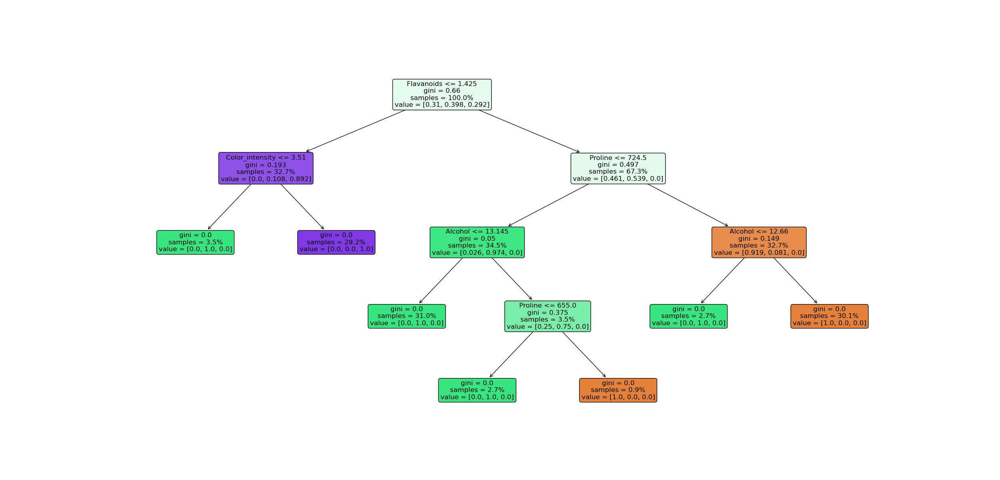
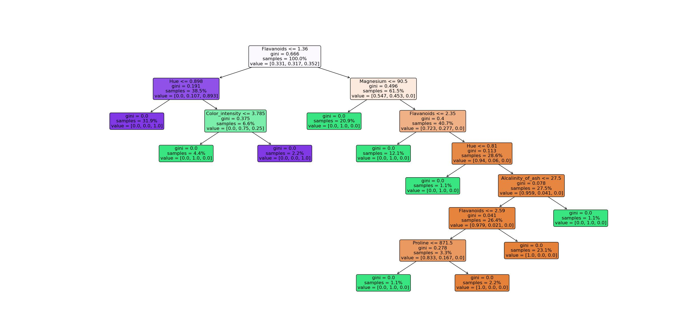

# Wine Origin Classification &#127863; 


This repository is dedicated for the jupyter notebook that used to perform classification of wines' origin based on its chemical composition. This open dataset is available on [UC Irvine Machine Learning Repository](https://archive.ics.uci.edu/dataset/109/wine) which can be publicly accessible using the python module named [ucimlrepo](https://archive.ics.uci.edu/dataset/109/wine). It can be installed using comand below

```
pip install ucimlrepo
```

## Algorithm used in the classification 	&#128187;
We adopted supervised learning for this classification task, primarily look into the DecisionTreeClassifier and RandomForestClassifier offered by the [scikit learn module](https://scikit-learn.org/stable/modules/generated/sklearn.ensemble.GradientBoostingClassifier.html) in python 


### How's was the performance of algorithm?  &#128200;

  * DecisionTreeClassifier 
  
  

  The best decision tree was shown as above with maximum depth of 4 and accuracy score of 0.97 for the test set. You may further refer to the Decision_tree.ipynb file.

  * RandomForestClassifier
  
  
  
  The figure above show one of the tree in best estimators from the GridSearchCV using the Random Forest algorithm. The best estimator was with the maximum depth of 10, 75 trees and random state of 42. The accuracy score was 1.0 for the test set. You may further refer to the RDF_WInes.ipynb file.

